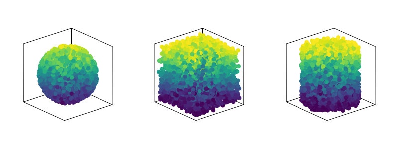

## Creating Atoms

`CoupledDipoles` currently supports only 3D objects, that is, `Sphere`, `Cube` and `Cylinder`, even though it is possible to extend many functionalities to `1D` and `2D` in future developments. To create atoms, use the `Atom` constructor.


```julia
using CoupledDipoles, CairoMakie, Random
Random.seed!(2354)
nAtoms = 5000

# CoupledDipoles and CairoMakie expoerts 'Sphere', therefore
# one needs to be specific
sphere_radius = 1.5
sphere_cloud = Atom(CoupledDipoles.Sphere(), nAtoms, sphere_radius)

cube_side = 1.0
cube_cloud = Atom(Cube(), nAtoms, cube_side)

cylinder_radius = 0.5
cylinder_height = 2.0
cylinder_cloud = Atom(Cylinder(), nAtoms, cylinder_radius, cylinder_height)
```

The result should like something similar to

```julia
fig = Figure(resolution = (800, 300))
ax_sphere = Axis3(fig[1:2, 1:2], aspect = (1, 1, 1))
ax_cube = Axis3(fig[1:2, 3:4], aspect = (1, 1, 1))
ax_cylinder = Axis3(fig[1:2, 5:6], aspect = (1, 1, 1))

sx, sy, sz = sphere_cloud.r[1, :], sphere_cloud.r[2, :], sphere_cloud.r[3, :]
scatter!(ax_sphere, sx, sy, sz, color = sz)

cx, cy, cz = cube_cloud.r[1, :], cube_cloud.r[2, :], cube_cloud.r[3, :]
scatter!(ax_cube, cx, cy, cz, color = cz)

cyx, cyy, cyz = cylinder_cloud.r[1, :], cylinder_cloud.r[2, :], cylinder_cloud.r[3, :]
scatter!(ax_cylinder, cyx, cyy, cyz, color = cyz)

hidedecorations!(ax_sphere)
hidedecorations!(ax_cube)
hidedecorations!(ax_cylinder)
fig

save("geometries.png", fig)
```


## User defined geometry

The `Atom` constructor holds the `shape` used for multiple-dispatch on the right physical equation, `r` is the matrix containg the atomic positions, `N` is the number of atom, and `sizes` is a generic radius for the system.
```julia
struct Atom{T<:Dimension}
    shape::T
    r::Matrix{Float64}
    N::Int64
    sizes::Any
end
```

If a user wants to create their own atomic configuration, there are two constraints to consider:

1. The shape field can be handled easily by choosing one of the available options: Sphere, Cube, or Cylinder.
2. The matrix containing the atom positions must have each Cartesian dimension represented by a row.

Here's an example code snippet demonstrating the creation of a custom atomic configuration:
```julia
# Define atom positions as separate arrays
atom_1 = [1, 1, 1]
atom_2 = [2, 2, 2]
atom_3 = [3, 3, 3]
atom_4 = [4, 4, 4]

# Combine atom positions into a single matrix
r = transpose(vcat(atom_1, atom_2, atom_3, atom_4))
# Note: The `transpose` function is used to fulfill the matrix constraint.

# Convert the transposed result to an actual matrix using `Array`
r = Array(r)
# Note: The `transpose` operation returns a non-matrix object, so we use `Array` to materialize it.

# Create the `Atom` object with the chosen shape and custom positions
dummy_dimension = 5
atoms = Atom(Cube(), r, dummy_dimension)
```

Ensure that the atom positions are arranged correctly in the matrix, with each row representing a Cartesian dimension. The usage of transpose, followed by Array, is necessary to adhere to the matrix requirements.


```@docs
Atom
```