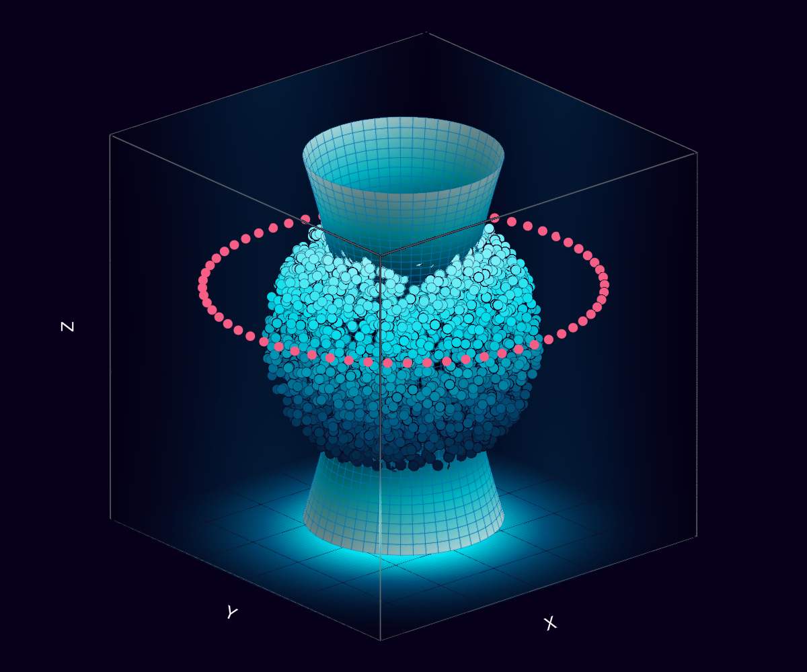

# CoupledDipoles.jl

## **Installation**
This is package is not registred in julia, you have to use its github URL

Due to its many dependencies, the installation process may take around 10 minutes and requires at least 16Gb of RAM on your device
```julia
import Pkg
# Pkg.add("MKL") # (if installation goes wrong, run this line, and try to install again)
Pkg.add(url="https://github.com/NoelAraujo/CoupledDipoles.jl")
```

To verify that everything is working correctly, run:

```julia
using CoupledDipoles
# Pkg.test("CoupledDipoles")
```

## First Example

Let's create a problem with `N=1000` atoms inside a `Cube` of size `kR=40`, pumped by a laser with saturation `s=1e-6` and on resonance `Δ=0`. We'll use the `Atom` and `Laser` constructors to define the `problem`, and then create a `Scalar Model`.

From the `problem` you get, for example, the [`steady_state`](@ref ss_page)

```julia
using CoupledDipoles
N, kR = 1000, 40
atoms = Atom(Cube(), N, kR)

s, Δ = 1e-6, 0.0
laser = Laser(PlaneWave3D(), s, Δ)
problem = LinearOptics(Scalar(), atoms, laser)
βₛₛ = steady_state(problem)
```

## Cool image
Check an atomic cloud pumped by a laser, and surrounded by a ring of sensors, where some scattered property can be measured.




Here is the code
```julia
using GLMakie, CoupledDipoles, LinearAlgebra, Random

## FIGURE COLORS
myBG = RGBf(6/255, 0, 26/255 )
myGridColor = RGBf(30/255, 0/255, 30/255 )
sensor_color = RGBf(247/255, 94/255, 133/255)
myColor =  cgrad(  [
    RGBf(0, 81/255, 123/255 ),
    RGBf(0, 221/255, 236/255),
    RGBf(201/255,251/255,255/255)
    ]
)

## DATA
Random.seed!(3456)
atoms = Atom(CoupledDipoles.Sphere(), 6000, 10)
x_a, y_a, z_a = atoms.r[1, :], atoms.r[2, :], atoms.r[3, :]

fig = let
    myColor =  cgrad(  [RGBf(4/255, 0, 21/255 ),
                        RGBf(0, 81/255, 123/255 ),
                        RGBf(0, 221/255, 236/255),
                        RGBf(201/255,251/255,255/255) ])
    fig = Figure(; size=(1200, 1000), backgroundcolor=myBG, fontsize=25)
    ax = Axis3(
        fig[1, 1];
        xlabel="X",
        ylabel="Y",
        zlabel="Z",

        zgridcolor=myGridColor,
        xgridcolor=myGridColor,
        ygridcolor=myGridColor,

        ztickcolor=:white,
        xtickcolor=:white,
        ytickcolor=:white,

        xlabelcolor=:white,
        ylabelcolor=:white,
        zlabelcolor=:white,
        titlecolor=:white,

        xgridwidth = 1,
        ygridwidth = 1,
        zgridwidth = 1,

        backgroundcolor=myBG,
        aspect = (1,1,1),

        xticksvisible = false,
        yticksvisible = false,
        zticksvisible = false,

        xticklabelsvisible = false,
        yticklabelsvisible = false,
        zticklabelsvisible = false,
    )


    w₀, s, Δ = 3π, 1e-5, 0.5
    laser = Laser(Gaussian3D(w₀), s, Δ)

    x = LinRange(-15, 15, 100)
    y = LinRange(-15, 15, 100)
    z = LinRange(-15, 15, 100)

    vol = [norm(laser_field(laser, [X, Y, Z])) for X ∈ x, Y ∈ y, Z ∈ z]
    plt = volumeslices!(ax, x, y, z, vol, colormap=myColor)
    idx_slice = 40
    plt[:update_yz][](99)
    plt[:update_xz][](99)
    plt[:update_xy][](1)
    ## ATOMOS
    validIdx = 1:6000
    scatter!(ax, x_a[validIdx], y_a[validIdx], z_a[validIdx],
        strokewidth=0.5, strokecolor=myGridColor,
        color=z_a[validIdx], colormap=myColor, markersize=20)


    ## LASER SHAPE
    a = w₀/2  # Scaling factor along x-axis
    b = w₀/2  # Scaling factor along y-axis
    c = 12.0  # Scaling factor along z-axis

    # Define the parametric equations for the 'hyperboloid'
    u = LinRange(-1, 1, 50)
    v = LinRange(0, 2 * pi, 50)
    X = [a*cosh(u)*cos(v) for u in u, v in v]
    Y = [b*cosh(u)*sin(v) for u in u, v in v]
    Z = [c*sinh(u) for u in u, v in v]

    surface!(ax, X, Y, Z; shading = Makie.automatic, 
        backlight = 1.0f0, color = sqrt.(X .^ 2 .+ Y .^ 2 .+ Z .^ 2),
        colormap = myColor, transparency = false,
        )
    wireframe!(ax, X, Y, Z; linewidth = 0.5, transparency = true)


    # SENSORES
    sensors = get_sensors_ring(; num_pts = 64, kR = 15, θ = 5π / 12)
    sx, sy, sz = sensors[1,:], sensors[2,:], sensors[3,:]
    scatter!(ax, sx, sy,sz,color=sensor_color, markersize=20)


    xlims!(ax, -15,15)
    ylims!(ax, -15,15)
    zlims!(ax, -15,15)
    fig
end
```


## Manual Outline
```@contents
```

