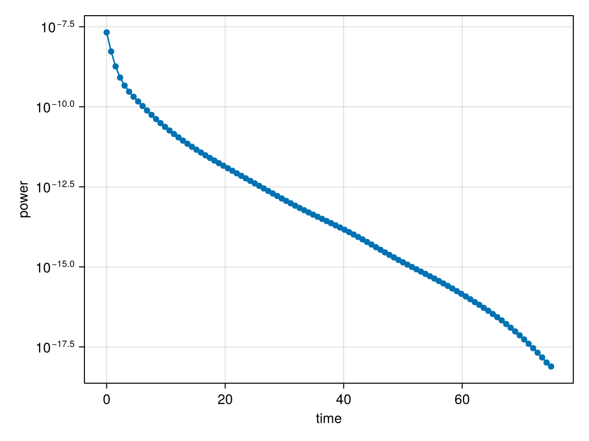

# Lasers

To drive interaction of the atomic cloud, one usually pump a Plane Wave of Gaussian Beam, therefore, you have the `PlaneWave` and `Gaussian` abstract types. In practive, as user, you will be dealing with their subtypes, the `PlaneWave3D` or `Gaussian3D`, but the most important object will be the `Laser`.

First an example with `PlaneWave3D`
```julia
s, Δ = 1e-5, 1.0 # good values
laser_plane = Laser(PlaneWave3D(), s, Δ)
```

For `Gaussian3D` you have to provide the beam `waist`

```julia
waist = 0.75*kL # there is no perfect value here
laser_gaussian = Laser(Gaussian3D(waist), s, Δ)
```

## `turn_off!`
If you need to turn off the pump, the function `turn_off!(laser)` does exactly what it imply, **but you cannot turn on later** - If you need the laser back, you have to make a copy of the original.

```julia
waist = 0.75*kL # there is no perfect value here
laser_gaussian = Laser(Gaussian3D(waist), s, Δ)

turn_off!(laser_gaussian)
```


Here a complete example of switch on-off dynamics

```julia
using CoupledDipoles, Random

# atom's settings
N, ρk⁻³ = 500, 0.02
N, kR = cube_inputs(N, ρk⁻³)
Random.seed!(1111)
atoms = Atom(CoupledDipoles.Sphere(), N, kR)

# laser's settings
s, Δ = 1e-5, -2.0
laser = Laser(Gaussian3D(kR / 2), s, Δ)

# create different models
scalar = LinearOptics(Scalar(), atoms, laser)
ss_scalar = steady_state(scalar) # use the laser to get the state state

# swtich-off dynamics
tspan = (0, 75.0) # interval extremas
saveat = range(tspan[1], tspan[2], length=100) # force states to saved on these times

turn_laser_off!(scalar) # have a time evolution without a pump
states_off = time_evolution(scalar, ss_scalar, tspan; saveat=saveat)

# get some property to vizualize
decay_power = map(states_off.u) do states
    scattered_power(scalar, states)
end

# using CairoMakie
# fig = Figure()
# ax = Axis(fig[1,1], xlabel="time", ylabel="power", yscale=log10)
# scatterlines!(ax, saveat, decay_power)
# fig
```



## Cool Image

You can actually see the spatial profile of your laser with a volume slice

```julia
 using GLMakie, CoupledDipoles, LinearAlgebra

## FIGURE COLORS
myBG = RGBf(6/255, 0, 26/255 )
myGridColor = RGBf(30/255, 0/255, 30/255 )
sensor_color = RGBf(247/255, 94/255, 133/255)
myColor =  cgrad(  [RGBf(0, 81/255, 123/255 ),
                    RGBf(0, 221/255, 236/255),
                    RGBf(201/255,251/255,255/255)])

myColor =  cgrad(  [RGBf(4/255, 0, 21/255 ),
                    RGBf(0, 81/255, 123/255 ),
                    RGBf(0, 221/255, 236/255),
                    RGBf(201/255,251/255,255/255)])
fig = Figure( backgroundcolor=myBG, size=(800, 800),)
ax = Axis3(fig[1, 1], aspect = (1,1,1),)

w₀, s, Δ = 1π, 1e-5, 0.5
laser = Laser(Gaussian3D(w₀), s, Δ)

x = LinRange(-10, 10, 50)
y = LinRange(-10, 10, 50)
z = LinRange(-10, 10, 50)

vol = [norm(laser_field(laser, [X, Y, Z])) for X ∈ x, Y ∈ y, Z ∈ z]
plt = volumeslices!(ax, x, y, z, vol, colormap=myColor)
plt[:update_yz][](25)
plt[:update_xz][](50)


fig

```


--- 

```@docs
PlaneWave3D
```

```@docs
Gaussian3D
```

For convenience, 

```@docs
Laser
```
