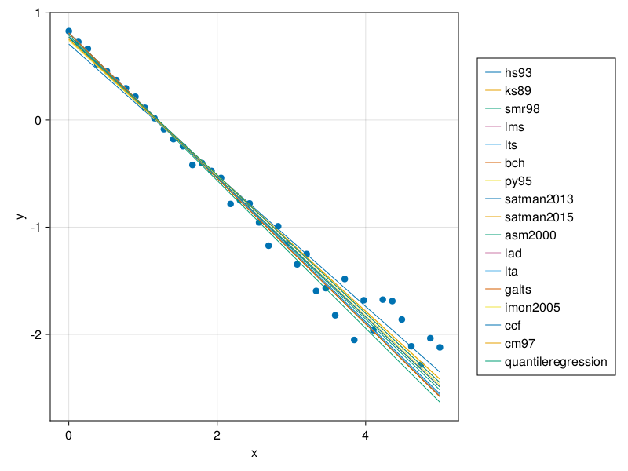

# Linear Regression with Noise Data

The localization length comes from noise data, and one needs to pre process the data before extracting any analysis. In this section, we show how we use the package `LinRegOutliers.jl` for our application.


Localization length, $\xi$, comes from the assumption that the data follows

$$y = A_0e^{-x/\xi}.$$

However, the package `LinRegOutliers.jl` works best with linear functions, thus, we define

$$Y = ln(A_0) -x/\xi$$

or

$$Y = A + Bx$$
Our goal then becomes to identify $\xi = -1/B$.

## Exponential with Noise
We will create some data and check for the methods avaiable on `LinRegOutliers.jl` that leads to best results. Our test function will be

$$y = 2.234e^{-x/1.345}$$

and we add white noise at each point of the domain $x$

```julia
using Random
Random.seed!(1234)

x = range(0, 5, length = 40)
y = log.(2.234exp.(-x/1.345) .+ rand(length(x)) ./ 10)
```

Now, we will create a functin that returns the coeficientes of the linear fit. For that, we specify our `@formula`, the `Dataframe` with our data, and use one of the available methods on `LinRegOutliers.jl`docs.

```julia
using LinRegOutliers, DataFrames
function linear_fit_robust(x, y; regression_method = lta)
	reg = createRegressionSetting(@formula(y ~ x), DataFrame([:x => x, :y => y]))
	result = regression_method(reg)

	A, B = result["betas"]
	y_fit = A .+ (B .* x)

	return A, B, y_fit
end
## test
A, B, y_fit = linear_fit_robust(x, y)
ξ = -1/B
```

Now, we can test and visualize the fitting result
```julia
using CairoMakie
scatter(x, y, axis=(xlabel="x", ylabel="y"))
lines!(x, y_fit, color = Cycled(2), linewidth = 5, label="ξ = $( round(ξ, digits=3))")
axislegend()
current_figure()
```


---
## Methods Comparison

The exact metho depends on the level of noise on the data. On this specific example, the best regression method was the `asm2000`.

```julia
begin
    fig = Figure()
    ax = Axis(fig[1, 1], xlabel = "x", ylabel="y")
    scatter!(ax, x, y)
	methods_list = [hs93, ks89, smr98, lms, lts, bch, py95, satman2013, satman2015,
		asm2000, lad, lta, galts, imon2005, ccf, cm97, quantileregression]
    comparisons = []
	for method in methods_list
		a, b, y_fit = linear_fit_robust(x, y; regression_method = method)
        lines!(ax, x, y_fit, linewidth = 1, label = "$(method)")

        comparison =  (-1/b)/1.345
        push!(comparisons, comparison)
	end
    value, idx  = findmin(comparisons)
    println("$(methods_list[idx]) had the best fitting, with ξ = $(value*1.345)")

    Legend(fig[1, 2], ax)
	current_figure()
end
```
