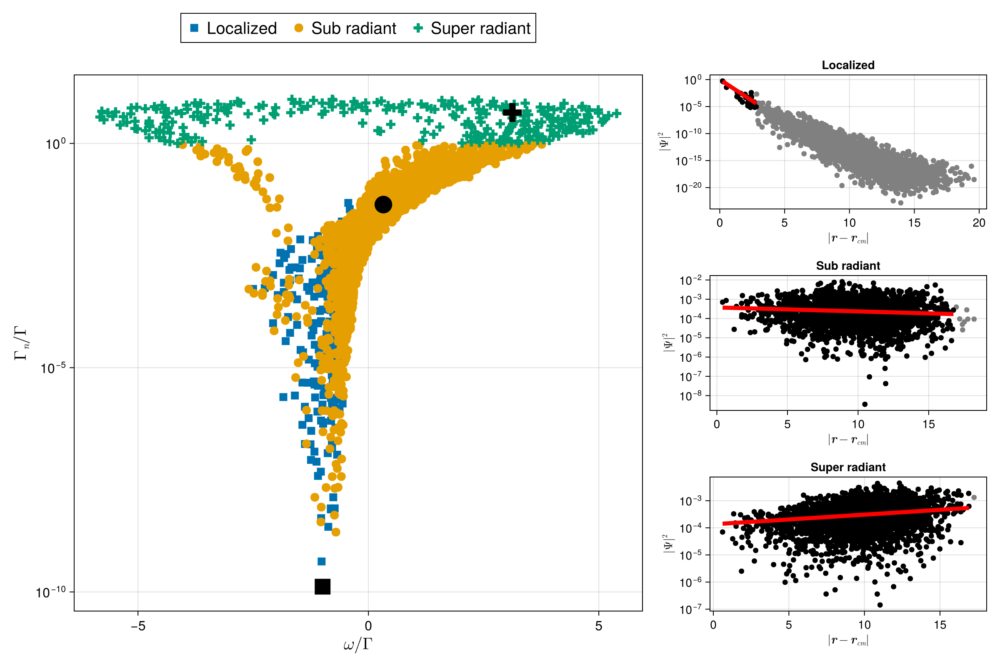

# Spectrum

You can use `eigenvalues` and `eigenvectors` to diagonalize the `interaction_matrix`. Typically, you are interested in the eigenvalues because their real and imaginary parts correspond to energy shifts and effective decay rates for different modes. Since the multiplicative constants in the `interaction_matrix` affect how you interpret the real and imaginary parts, use the `spectrum` function to avoid confusion.

The figure below showcase the spectrum of the simulation in localizaed regime ($\rho > 0.1$) next to some [`spatial profiles`](@ref Localization).




```julia
using CoupledDipoles, CairoMakie, Random

N, ρ = 2500, 0.3
Random.seed!(16)
atoms = Atom(CoupledDipoles.Cube(), cube_inputs(N, ρ)...)

w₀, s, Δ = 4π, 1e-5, 0.0
laser = Laser(Gaussian3D(w₀), s, Δ)

prob = LinearOptics(Scalar(), atoms, laser)
modes = classify_modes(prob)

ωₙ, Γₙ = spectrum(prob)

# best case examples
loc_idx = modes.loc[end]
sub_idx = modes.sub[500]
super_idx = modes.super[100]

begin
    fig = Figure(size=(1200, 800))

    # Main spectrum plot
    ax_main = Axis(fig[1:3, 1:2],
        xlabel=L"\omega/\Gamma",
        ylabel=L"\Gamma_n/\Gamma",
        xscale=identity,
        yscale=log10,
        xlabelsize=20,
        ylabelsize=20,
        xticklabelsize=16,
        yticklabelsize=16)

    labels = ["Localized", "Sub radiant", "Super radiant"]
    shapes = [:rect, :circle, :cross]
    # spectrum
    for (i, mode) in enumerate(modes)
        scatter!(ax_main, ωₙ[mode], Γₙ[mode],
            label=labels[i],
            markersize=15,
            marker=shapes[i])
    end

    # indicate selected modes
    mode_indices = [loc_idx, sub_idx, super_idx]
    for (i, idx) in enumerate(mode_indices)
        scatter!(ax_main, [ωₙ[idx]], [Γₙ[idx]],
            marker=shapes[i],
            color=:black,
            markersize=30)
    end
    Legend(fig[0, 1:2], ax_main, orientation=:horizontal, labelsize=20)

    # Spatial profile
    for (i, idx) in enumerate(mode_indices)
        DCM, ψ² = spatial_profile_single_mode(prob, idx)
        ax = Axis(fig[i, 3], yscale=log10,
            xlabel=L"|\mathbf{r} - \mathbf{r}_{cm}|",
            ylabel=L"|\Psi|^2",
            title=labels[i])
        scatter!(ax, DCM, ψ², color=:grey)

        x_used, y_used = select_points(DCM, ψ²)
        scatter!(ax, x_used, y_used, color=:black)

        A, B, y_fit = CoupledDipoles.linear_fit_robust(x_used, log10.(y_used))
        lines!(ax, x_used, exp10.(y_fit), linestyle=:solid, linewidth=5, color=:red)
    end

    fig
end

save("modes_comparison.png", fig)
```

## Faster eigenvalues/eigenvectors

Verify on your machine if you have some extra performance boost using MKL version provided by the `numpy`.

I had not investigate the finding, just take note for future reference.

```julia
using CoupledDipoles
N, ρk⁻³ = 1500, 1.0
atoms = Atom(CoupledDipoles.Sphere(), sphere_inputs(N, ρk⁻³)...)

s, Δ = exp10(-5), 1.0
laser = Laser(PlaneWave3D(), s, Δ)

prob = LinearOptics(Scalar(), atoms, laser)
@time eigenvectors(prob;forceComputation=true);

using PyCall
np = pyimport("numpy")
@time begin 
    H = interaction_matrix(prob)
    H_np = np.array(H)
    eigen_values, eigen_vectors = np.linalg.eig(H_np)
end;
```

---


```@docs
interaction_matrix
```

```@docs
spectrum
```

```@docs
eigenvalues
```

```@docs
eigenvectors
```
