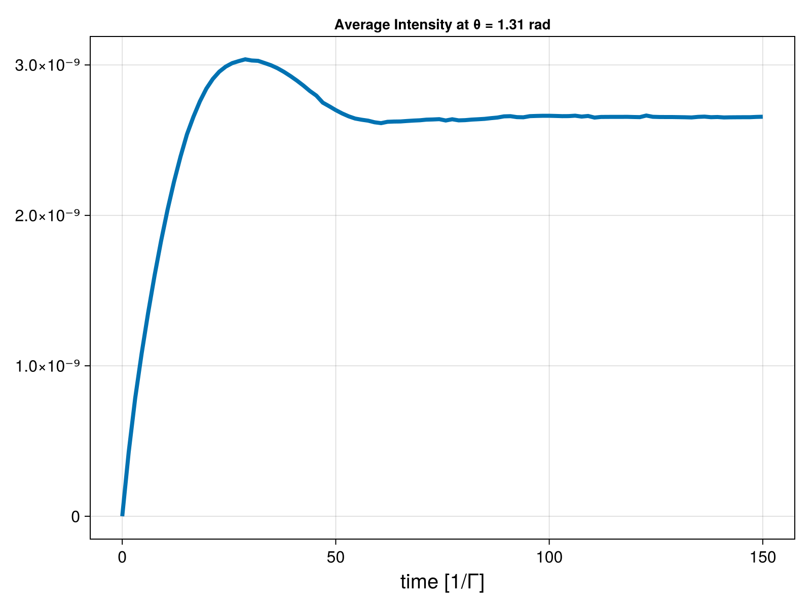

# Time Evolution

The equations for time evolution depend on the model. For 3D models, these equations are detailed in Chapter 2 of the [Thesis](https://doi.org/10.11606/T.76.2024.tde-26012024-114225).

To use the `time_evolution` method, you only need to provide the problem and detuning range. This method outputs a tuple of the atomic states containing time stamps (atomic\_states.t) and atomic states (atomic\_states.u). It relies on the `OrdinaryDiffEq` package, allowing you to control the solver directly if needed.



```julia
using CoupledDipoles, CairoMakie, Random

N, ρ = 25, 0.1
Random.seed!(16)
atoms = Atom(CoupledDipoles.Sphere(), sphere_inputs(N, ρ)...)

w₀, s, Δ = 4π, 1e-5, 0.0
laser = Laser(Gaussian3D(w₀), s, Δ)
prob = NonLinearOptics(MeanField(), atoms, laser)

u₀ = default_initial_condition(prob)
tspan = (0, 150)
saveat = range(tspan[1], tspan[2], length=100) # force states to saved on these times
states_on = time_evolution(prob, u₀, tspan; saveat=saveat)

θ = deg2rad(75)
intensity_on = get_intensity_over_an_angle(prob, states_on.u, θ)


fig = Figure(size=(800, 600))
ax = Axis(fig[1, 1],
    xlabel="time [1/Γ]",
    title="Average Intensity at θ = $(round(θ, digits=2)) rad",
    xlabelsize=20,
    ylabelsize=20,
    xticklabelsize=16,
    yticklabelsize=16
)

lines!(ax, saveat, intensity_on, label="", linewidth=4)
display(fig)


save("time_evolution.png", fig)
```
---

```@docs
time_evolution
```