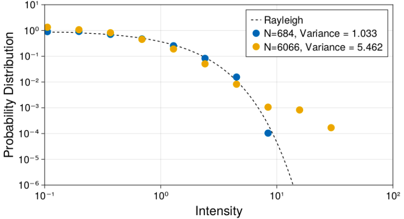

# Deviations from Rayleigh's law

Our goal is to reproduce `Figure 2` from the paper [Cottier et all, 2019](http://www.kaiserlux.de/coldatoms/Articles/Fluctuations.pdf), where the authors studied the statistics of the scattered light, and found that the **variance** of the intensity distribution deviates from the expected Rayleigh's law.

With exception of the `Step 1`, the code is expected to run without any adjustments.

*Step 1*

Load the necessary packages. For me (the author), I prefer to execute all repetitions in parallel in my home made cluster. If you don't want parallel processing, just remove the process nodes.

```julia
@time begin
    using CairoMakie, LinearAlgebra
    using Statistics: mean, var
    using StatsBase: fit, normalize, Histogram
end

@time begin
    using Distributed

    ## for local paralellism
    addprocs(2; exeflags=`--project=$(Base.active_project()) --threads 4`, topology=:master_worker, enable_threaded_blas=true)

    ## for remote machines
    # ip_m2 = "pc2@192.168.15.8"
    # nprocess_m2 = 2
    # machine2 = [(ip_m2, nprocess_m2)]
    # addprocs(
    #     machine2;
    #     topology = :master_worker,
    #     exeflags = `--threads 6`,
    #     enable_threaded_blas = true,
    #     exename = "/home/pc2/julia/julia-1.8.0-rc3/bin/julia",
    #     dir = "/home/pc2",
    # )

    # ip_m3 = "pc3@192.168.15.7"
    # nprocess_m3 = 2
    # machine3 = [(ip_m3, nprocess_m3)]
    # addprocs(
    #     machine3;
    #     topology = :master_worker,
    #     exeflags = `--threads 4`,
    #     enable_threaded_blas = true,
    #     exename = "/home/pc3/julia_program/julia-1.8.0-rc3/bin/julia",
    #     dir = "/home/pc3",
    # )
end

@time @everywhere begin
    using CoupledDipoles
    using ProgressMeter, Random
end
```

*Step 2*
We use the exact configuration parameters from the paper. You will notice may `Warning` messages. This happen because a small laser waist leads to unreasonable results.

If you are studying Cottier's paper, note that the results from the paper are **not accurate** due to its small laser waist, even though they general paper's message is still correct.


```julia
### ------------ ATOMS SPECS ---------------------
L = 32.4
N = [684, 6066]


### ------------ LASER SPECS ---------------------
Δ = 1.0
s = 1e-6
w₀ = L / 4

### ------------ SIMULATION SPECS ---------------------
sensors = get_sensors_ring(; num_pts = 720, kR = 300, θ = 5π / 12)
maxRep = 15
```

*Step 3*

For each atom number `N`, create `maxRep` atomic configurations, compute their state states, and scattered light intensity. The normalization over the mean comes from the paper.

```julia
### -------- PRODUCE INTENSITIES -----------------
all_intensities = map(N) do N
    many_intensities = @showprogress pmap(1:maxRep) do rep
        Random.seed!(1134 + rep)

        atoms = Atom(Cube(), N, L)
        laser = Laser(Gaussian3D(w₀), s, Δ)
        simulation = LinearOptics(Scalar(), atoms, laser)

        βₙ = steady_state(simulation)
        intensities = scattered_intensity(simulation, βₙ, sensors; regime = :far_field)

        intensities
    end

    many_intensities = reduce(vcat, many_intensities)
    all_intensities_over_mean = many_intensities ./ mean(many_intensities)

    all_intensities_over_mean
end
```


*Step 4*

Instead of ploting `histogram` for each particle number, we are interested in the **data** from the `histogram` to display it in a `scatter` plot. Also, this is the moment to compute the variance of all intensities.


```julia
### ------------ CREATE HISTOGRAM ---------------------
bins = 10.0 .^ range(log10(1e-6), log10(75); length = 30)

xy_data = map(eachindex(N)) do n
    h = fit(Histogram, all_intensities[n], bins)

    h_norm = normalize(h; mode = :pdf)
    bins_edges = collect(h_norm.edges[1])
    bins_centers = [sqrt(bins_edges[i] * bins_edges[i+1]) for i = 1:(length(bins_edges)-1)]
    variance = var(all_intensities[n])

    # x_data_histogram, y_data_histogram, variance
    (bins_centers, h_norm.weights, variance)
end
```


*Step 5*

Overlay the Distribution Probability in a single figure.

The `begin-end` structure is just to facilitate the Figure development for the user. It is easier to just run the block at once at every little plot tweak, than select and run everything all the time.

```julia
### ------------ FINAL PLOT ---------------------
begin
    fig = Figure(resolution = (800, 450))
    ax = Axis(
        fig[1, 1],
        xlabel = "Intensity",
        ylabel = "Probability Distribution",
        title = "",
        xlabelsize = 25,
        ylabelsize = 25,
        xticklabelsize = 20,
        yticklabelsize = 20,
        xscale = log10,
        yscale = log10,
    )

    ## theoretical curve
    x_ray = range(0.01, 50; step = 0.15)
    y_ray = exp.(-x_ray)
    lines!(ax, x_ray, y_ray, linestyle = :dash, label = "Rayleigh", color = :black, lw = 4)

    for n = 1:2
        x = xy_data[n][1]
        y = xy_data[n][2]
        v = xy_data[n][3] # variance
        notNull = findall(y .> 0)
        scatter!(
            ax,
            x[notNull],
            y[notNull];
            label = "N=$(N[n]), Variance = $( round(v,digits=3 ))",
            markershape = :circle,
            markersize = 20,
        )
    end
    ylims!(1e-6, 10)
    xlims!(1e-1, 100)
    axislegend(position = :rt, labelsize = 20)
    fig
end
```

